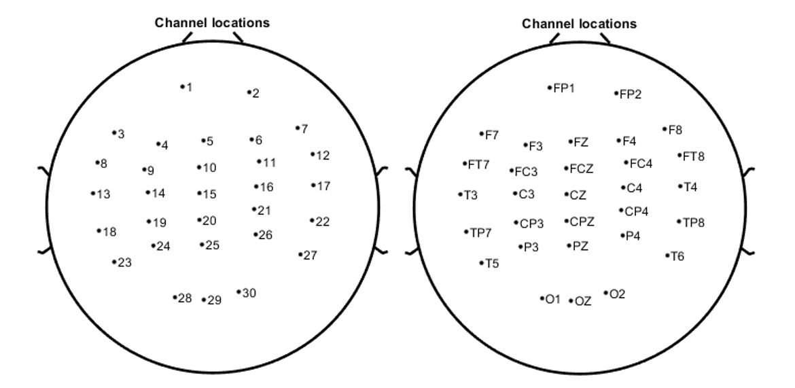

# IC-U-Net

<iframe width="560" height="315" src="https://www.youtube.com/embed/0tHadL3kRjc" title="YouTube video player" frameborder="0" allow="accelerometer; autoplay; clipboard-write; encrypted-media; gyroscope; picture-in-picture" allowfullscreen></iframe>

## Introduction
This is the Computational NeuroErgonomics x NeuroEducation ([CNElab](https://sites.google.com/view/chchuang/CNElab?authuser=0)) on EEG artifacts removal end-to-end process: [IC-U-Net](https://www.sciencedirect.com/science/article/pii/S1053811922007017): A U-Net based Denoising Autoencoders using Mixtures of Independent Components for Automatic EEG Artifact Removal, written in Pytorch. This journal has been accept by NeuroImage (IF:7.4). The aim of.  this project is to
* A novel EEG artifact removal method, IC-U-Net, is proposed.
* IC-U-Net is built based on the U-Net architecture with a loss function ensemble.
* IC-U-Net is trained using mixtures of EEG sources decomposed by independent component analysis.
* IC-U-Net does not require parameter tuning and can simultaneously remove various types of artifacts.
* IC-U-Net can facilitate the extraction of relatively more brain sources from noisy EEG signals.

## Requirements
* Python >= 3.8.13
* numpy >= 1.19.2
* Pytorch >= 1.11.0 (can just use cpu)
* scipy >= 1.10.1

> __Below we assume the working directory is the repository root.__

- Using pip

  ```sh
  # Install the dependencies
  pip install -r requirements.txt
  ```

- (if requirements.txt is not work)
  ```sh
  pip install numpy
  pip install torch torchvision torchaudio
  pip install scipy
  ```

## Data Specification

The data format must be a two-dimensional array (30 channels, any timepoint), and the order of the channels please refer to the figure above.

> The sample data `sampledata.csv` (30, 12568) is stored under the `./sampledata` folder, where the sample rate is 256 Hz.

## Running Step
- Step 1: Setting the parameters. Please modify `main.py` file in following scope:
```python
# parameter setting
input_path = './sampledata/'
input_name = 'sampledata.csv'
sample_rate = 256 # input data sample rate
modelname = 'ICUNet' # or 'UNetpp'
output_path = './sampledata/'
output_name = 'outputsample.csv'
```
- Step 2: Runing `main.py` in your terminal:
```sh
python main.py
```


## Evaluated Dataset
We evaluate the model with lane-keeping drive data collected and walking experiment from [scientific data](https://www.nature.com/articles/s41597-019-0027-4) and [mygooglecloud](https://drive.google.com/drive/folders/1B8smvaYGgC-y_TSshIG23JbMmawoaA5E?usp=sharing).

> __Ethics approval__ 
All participants completed informed consent forms after receiving a complete explanation of the study. The Institutional Review Board of Taipei Veterans General Hospital approved the study protocol.

> __Consent to participate__
All of the participants provided written informed consent prior to participation. The consent regarding publishing their data as a scientific report was also included.

## Sample Results
(writing)

## Papers
Under review on [NeuroImage](https://www.journals.elsevier.com/neuroimage)

## Acknowledgement
This work was supported by the Ministry of Science and Technology, Taiwan (project numbers: MOST 110-2636-E-007-018 and 109-2636-E-007-022), and by the Research Center for Education and Mind Sciences, National Tsing Hua University. No funding source had involved in any of the research procedures.

